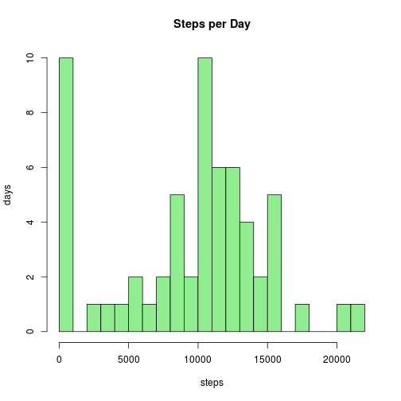
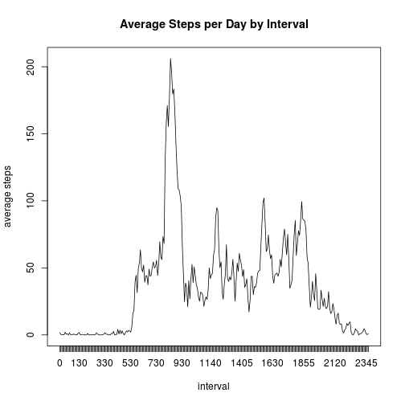
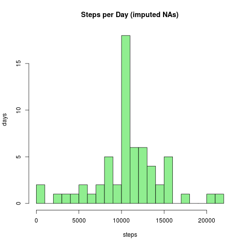
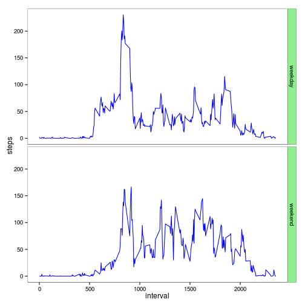

## Non-Core R Package Dependancies

* knitr 1.9
* ggplot2 1.0.1


```r
library(ggplot2)
```

## Using this Document

This document `PA1_template.Rmd` can be processed from any
[R](http://cran.utstat.utoronto.ca/) console using the
[knitr](http://yihui.name/knitr/) package, provided you have the data file
[`activity.csv`](https://d396qusza40orc.cloudfront.net/repdata%2Fdata%2Factivity.zip)
in the same directory where this file is located. From the R console, load the
`knitr` package and process the file as follows:

    > library(knitr)
    > knit2html("./PA1_template.Rmd")

## Charting Notes

The charts in this document were originally plotted using R's native plotting
functions. Some of the plots have subsequently been converted to ggplot2 simply
as an exercise in using ggplot2.

## Loading and Preprocessing the Data

Show any code that is needed to:

1. Load the data.


```r
activity <- read.csv("./activity.csv", 
                     colClasses = c("integer", "Date", "integer"))
str(activity)
```

```
## 'data.frame':	17568 obs. of  3 variables:
##  $ steps   : int  NA NA NA NA NA NA NA NA NA NA ...
##  $ date    : Date, format: "2012-10-01" "2012-10-01" ...
##  $ interval: int  0 5 10 15 20 25 30 35 40 45 ...
```

```r
head(activity)
```

```
##   steps       date interval
## 1    NA 2012-10-01        0
## 2    NA 2012-10-01        5
## 3    NA 2012-10-01       10
## 4    NA 2012-10-01       15
## 5    NA 2012-10-01       20
## 6    NA 2012-10-01       25
```

2. Process/transform the data (if necessary) into a format suitable for your
analysis.


```r
# pre-processing as/if needed
```

## What is mean total number of steps taken per day?

For this part of the assignment, you can ignore the missing values in the
dataset.

1. Calculate the total number of steps taken per day.


```r
steps_per_day <- tapply(activity$steps, activity$date, sum, na.rm = T)
head(steps_per_day)
```

```
## 2012-10-01 2012-10-02 2012-10-03 2012-10-04 2012-10-05 2012-10-06 
##          0        126      11352      12116      13294      15420
```

2. Make a histogram of the total number of steps taken each day.


```r
hist(steps_per_day, 
     breaks = 20, 
     main = "Steps per Day", 
     xlab = "steps", 
     ylab = "days",
     col = "lightgreen")
```

 

3. Calculate and report the mean and median of the total number of steps taken
per day.

I assume the desired outcome here is not the daily mean and median per day (two
values *per day*) but rather the mean and median values across all days, where
the days have been aggragated as in step 1 above (two values *in total*).


```r
mean(steps_per_day)
```

```
## [1] 9354.23
```

```r
median(steps_per_day)
```

```
## [1] 10395
```

## What is the average daily activity pattern?

1. Make a time series plot (i.e. type = "l") of the 5-minute interval (x-axis)
and the average number of steps taken, averaged across all days (y-axis)


```r
mean_steps_by_interval <- tapply(activity$steps, 
                                 activity$interval, 
                                 mean, 
                                 na.rm = T)
head(mean_steps_by_interval)
```

```
##         0         5        10        15        20        25 
## 1.7169811 0.3396226 0.1320755 0.1509434 0.0754717 2.0943396
```

```r
summary(mean_steps_by_interval)
```

```
##    Min. 1st Qu.  Median    Mean 3rd Qu.    Max. 
##   0.000   2.486  34.110  37.380  52.830 206.200
```

```r
plot(mean_steps_by_interval,
     type = "l",
     main = "Average Steps per Day by Interval",
     xaxt = "n",
     xlab = "interval", ylab = "average steps")
axis(1, 
     at = 1:length(mean_steps_by_interval), 
     labels = names(mean_steps_by_interval))
```

 

2. Which 5-minute interval, on average across all the days in the dataset,
contains the maximum number of steps?


```r
mean_steps_by_interval[which.max(mean_steps_by_interval)]
```

```
##      835 
## 206.1698
```

Interval 835 (08:35 AM) has the highest average number of steps.

## Imputing missing values

Note that there are a number of days/intervals where there are missing values
(coded as NA). The presence of missing days may introduce bias into some
calculations or summaries of the data.

1. Calculate and report the total number of missing values in the dataset (i.e.
the total number of rows with NAs)


```r
nrow(activity[is.na(activity$steps)==T, ])
```

```
## [1] 2304
```

There are 2,304 missing values.

2. Devise a strategy for filling in all of the missing values in the dataset.
The strategy does not need to be sophisticated. For example, you could use the
mean/median for that day, or the mean for that 5-minute interval, etc.

We replace NA values with the mean value for the interval in question.

3. Create a new dataset that is equal to the original dataset but with the
missing data filled in.


```r
activity_imputed <- activity

mean_steps_by_interval_imputed <- tapply(activity_imputed$steps, 
                                         activity_imputed$interval, 
                                         mean, 
                                         na.rm = T)

na_replace <- function (interval) {
  return(mean_steps_by_interval_imputed[as.character(interval)])
}

for (i in 1:nrow(activity_imputed)) {
  if (is.na(activity_imputed[i,1])) {
    activity_imputed[i,1] <- na_replace(activity_imputed[i,3])
  }
}
head(activity_imputed)
```

```
##       steps       date interval
## 1 1.7169811 2012-10-01        0
## 2 0.3396226 2012-10-01        5
## 3 0.1320755 2012-10-01       10
## 4 0.1509434 2012-10-01       15
## 5 0.0754717 2012-10-01       20
## 6 2.0943396 2012-10-01       25
```

4. Make a histogram of the total number of steps taken each day and Calculate
and report the mean and median total number of steps taken per day. Do these
values differ from the estimates from the first part of the assignment? What is
the impact of imputing missing data on the estimates of the total daily number
of steps?


```r
steps_per_day_imputed <- tapply(activity_imputed$steps, 
                                activity_imputed$date, 
                                sum, 
                                na.rm = T)
head(steps_per_day_imputed)
```

```
## 2012-10-01 2012-10-02 2012-10-03 2012-10-04 2012-10-05 2012-10-06 
##   10766.19     126.00   11352.00   12116.00   13294.00   15420.00
```

```r
hist(steps_per_day_imputed, 
     breaks = 20, 
     main = "Steps per Day (imputed NAs)", 
     xlab = "steps", 
     ylab = "days",
     col = "lightgreen")
```

 

```r
mean(steps_per_day_imputed)
```

```
## [1] 10766.19
```

```r
median(steps_per_day_imputed)
```

```
## [1] 10766.19
```

The NAs were previously skewing the histogram, being classified into the [0,
1000] bin. The mean and median are now equal to each other and greater than the
previous values.

## Are there differences in activity patterns between weekdays and weekends?

For this part the weekdays() function may be of some help here. Use the dataset
with the filled-in missing values for this part.

1. Create a new factor variable in the dataset with two levels – “weekday” and
“weekend” indicating whether a given date is a weekday or weekend day.


```r
activity_imputed$weekday <- weekdays(activity_imputed$date)
activity_imputed$weekend_or_weekday <- "weekday"
activity_imputed[activity_imputed$weekday %in% c("Saturday","Sunday"), 5] <- "weekend"
head(activity_imputed)
```

```
##       steps       date interval weekday weekend_or_weekday
## 1 1.7169811 2012-10-01        0  Monday            weekday
## 2 0.3396226 2012-10-01        5  Monday            weekday
## 3 0.1320755 2012-10-01       10  Monday            weekday
## 4 0.1509434 2012-10-01       15  Monday            weekday
## 5 0.0754717 2012-10-01       20  Monday            weekday
## 6 2.0943396 2012-10-01       25  Monday            weekday
```

2. Make a panel plot containing a time series plot (i.e. type = "l") of the
5-minute interval (x-axis) and the average number of steps taken, averaged
across all weekday days or weekend days (y-axis). See the README file in the
GitHub repository to see an example of what this plot should look like using
simulated data.


```r
d <- aggregate(steps ~ weekend_or_weekday + interval, activity_imputed, mean)
g <- ggplot(d, aes(interval, steps))
g + geom_line(col = "blue") + 
  facet_grid(weekend_or_weekday ~ .) + 
  labs( y = "steps") + 
  theme_bw() + 
  theme(panel.grid = element_blank()) + 
  theme(strip.background = element_rect(fill = "lightgreen"))
```

 

The charts indicate that, during the working week, there is a surge in walking
activity in the morning, while on the weekend walking activity is more evenly
spread out throughout the day.

